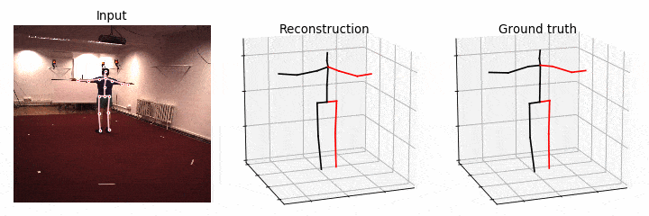
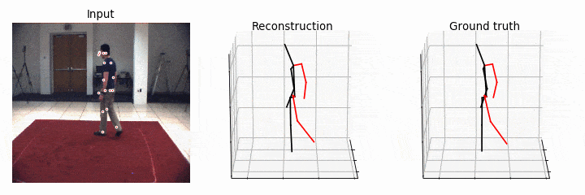
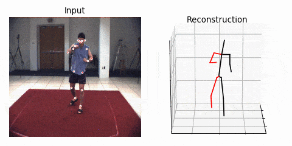
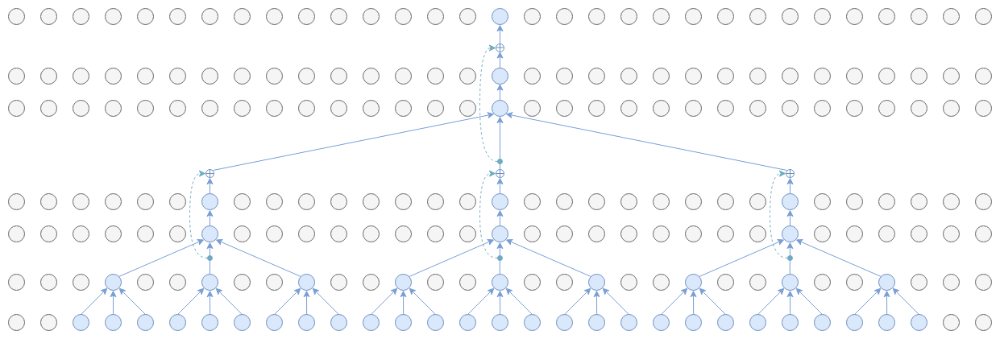
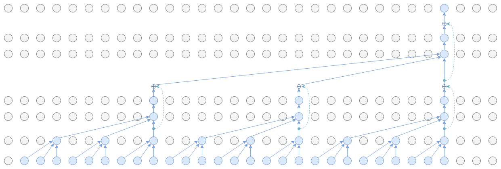

# Documentation
This guide explains in depth all the features of this framework. Make sure you have read the quick start guide in [`README.md`](README.md) before proceeding.

## Training
By default, the script `run.py` runs in training mode. The list of command-line arguments is defined in `common/arguments.py`.

- `-h`: shows the help / list of parameters.
- `-d` or `--dataset`: specifies the dataset to use (`h36m` or `humaneva15`). Default: `h36m`. If you converted the 20-joint HumanEva skeleton, you can also use `humaneva20`.
- `-k` or `--keypoints`: specifies the 2D detections to use. Default: `cpn_ft_h36m_dbb` (CPN fine-tuned on Human 3.6M).
- `-c` or `--checkpoint`: specifies the directory where checkpoints are saved/read. Default: `checkpoint`.
- `--checkpoint-frequency`: save checkpoints every N epochs. Default: `10`.
- `-r` or `--resume`: resume training from a particular checkpoint (you should only specify the file name, not the path), e.g. `epoch_10.bin`.
- `-str` or `--subjects-train`: specifies the list of subjects on which the model is trained, separated by commas. Default: `S1,S5,S6,S7,S8`. For HumanEva, you may want to specify these manually.
- `-ste` or `--subjects-test`: specifies the list of subjects on which the model is tested at the end of each epoch (and in the final evaluation), separated by comma. Default: `S9,S11`. For HumanEva, you may want to specify these manually.
- `-a` or `--actions`: select only a subset of actions, separated by commas. E.g. `Walk,Jog`. By default, all actions are used.
- `-e` or `--epochs`: train for N epochs, i.e. N passes over the entire training set. Default: `60`.
- `--no-eval`: disable testing at the end of each epoch (marginal speed up). By default, testing is enabled.
- `--export-training-curves`: export training curves as PNG images after every epoch. They are saved in the checkpoint directory. Default: disabled.


If `--no-eval` is not specified, the model is tested at the end of each epoch, although the reported metric is merely an approximation of the final result (for performance reasons). Once training is over, the model is automatically tested using the full procedure. This means that you can also specify the testing parameters when training.

Here is a description of the model hyperparameters:
- `-s` or `--stride`: the chunk size used for training, i.e. the number of frames that are predicted at once from each sequence. Increasing this value improves training speed at the expense of the error (due to correlated batch statistics). Default: `1` frame, which ensures maximum decorrelation. When this value is set to `1`, we also employ an optimized implementation of the model (see implementation details).
- `-b` or `--batch-size`: the batch size used for training the model, in terms of *output frames* (regardless of the stride/chunk length). Default: `1024` frames.
- `-drop` or `--dropout`: dropout probability. Default: `0.25`.
- `-lr` or `--learning-rate`: initial learning rate. Default: `0.001`.
- `-lrd` or `--lr-decay`: learning rate decay after every epoch (multiplicative coefficient). Default: `0.95`.
- `-no-tta` or `--no-test-time-augmentation`: disable test-time augmentation (which is enabled by default), i.e. do not flip poses horizontally when testing the model. Only effective when combined with data augmentation, so if you disable this you should also disable train-time data augmentation.
- `-no-da` or `--no-data-augmentation`: disable train-time data augmentation (which is enabled by default), i.e. do not flip poses horizontally to double the training data.
- `-arc` or `--architecture`: filter widths (only odd numbers supported) separated by commas. This parameter also specifies the number of residual blocks, and determines the receptive field of the model. The first number refers to the input layer, and is followed by the filter widths of the residual blocks. For instance, `3,5,5` uses `3x1` convolutions in the first layer, followed by two residual blocks with `5x1` convolutions. Default: `3,3,3`. Some valid examples are:
-- `-arc 3,3,3` (27 frames)
-- `-arc 3,3,7` (63 frames)
-- `-arc 3,3,3,3` (81 frames)
-- `-arc 3,3,3,3,3` (243 frames)
- `--causal`: use causal (i.e. asymmetric) convolutions instead of symmetric convolutions. Causal convolutions are suitable for real-time applications because they do not exploit future frames (they only look in the past), but symmetric convolutions result in a better error since they can consider both past and future data. See below for more details.  Default: disabled.
- `-ch` or `--channels`: number of channels in convolutions. Default: `1024`.
- `--dense`: use dense convolutions instead of dilated convolutions. This is only useful for benchmarks and ablation experiments.
- `--disable-optimizations`: disable the optimized implementation when `--stride` == `1`. This is only useful for benchmarks.

## Semi-supervised training
Semi-supervised learning is only implemented for Human3.6M.

- `-sun` or `--subjects-unlabeled`: specifies the list of unlabeled subjects that are used for semi-supervision (separated by commas). Semi-supervised learning is automatically enabled when this parameter is set.
- `--warmup`: number of supervised training epochs before attaching the semi-supervised loss. Default: `1` epoch. You may want to increase this when downsampling the dataset.
- `--subset`: reduce the size of the training set by a given factor (a real number). E.g. `0.1` uses one tenth of the training data. Subsampling is achieved by extracting a random contiguous chunk from each video, while preserving the original frame rate. Default: `1` (i.e. disabled). This parameter can also be used in a supervised setting, but it is especially useful to simulate data scarcity in a semi-supervised setting.
- `--downsample`: reduce the dataset frame rate by an integer factor. Default: `1` (i.e. disabled).
- `--no-bone-length`: do not add the bone length term to the unsupervised loss function (only useful for ablation experiments).
- `--linear-projection`: ignore non-linear camera distortion parameters when performing projection to 2D, i.e. use only focal length and principal point.
- `--no-proj`: do not add the projection consistency term to the loss function (only useful for ablations).

## Testing
To test a particular model, you need to specify the checkpoint file via the `--evaluate` parameter, which will be loaded from the checkpoint directory (default: `checkpoint/`, but you can change it using the `-c` parameter). You also need to specify the same settings/hyperparameters that you used for training (e.g. input keypoints, architecture, etc.). The script will not run any compatibility checks -- this is a design choice to facilitate ablation experiments.

## Visualization
You can render videos by specifying both `--evaluate` and  `--render`. The script generates a visualization which contains three viewports: the 2D input keypoints (and optionally, a video overlay), the 3D reconstruction, and the 3D ground truth.
Note that when you specify a video, the 2D detections are still loaded from the dataset according to the given parameters. It is up to you to choose the correct video. You can also visualize unlabeled videos -- in this case, the ground truth will not be shown.

Here is a list of the command-line arguments related to visualization:
- `--viz-subject`: subject to render, e.g. `S1`.
- `--viz-action`: action to render, e.g. `Walking` or `Walking 1`.
- `--viz-camera`: camera to render (integer), from 0 to 3 for Human3.6M, 0 to 2 for HumanEva. Default: `0`.
- `--viz-video`: path to the 2D video to show. If specified, the script will render a skeleton overlay on top of the video. If not specified, a black background will be rendered instead (but the 2D detections will still be shown). 
- `--viz-skip`: skip the first N frames from the specified video. Useful for HumanEva. Default: `0`.
- `--viz-output`: output file name (either a `.mp4` or `.gif` file).
- `--viz-bitrate`: bitrate for MP4 videos. Default: `3000`.
- `--viz-no-ground-truth`: by default, the videos contain three viewports: the 2D input pose, the 3D reconstruction, and the 3D ground truth. This flags removes the last one.
- `--viz-limit`: render only first N frames. By default, all frames are rendered.
- `--viz-downsample`: downsample videos by the specified factor, i.e. reduce the frame rate. E.g. if set to `2`, the frame rate is reduced from 50 FPS to 25 FPS. Default: `1` (no downsampling).
- `--viz-size`: output resolution multiplier. Higher = larger images. Default: `5`.
- `--viz-export`: export 3D joint coordinates (in camera space) to the specified NumPy archive.

Example:
```
python run.py -k cpn_ft_h36m_dbb -arc 3,3,3,3,3 -c checkpoint --evaluate pretrained_h36m_cpn.bin --render --viz-subject S11 --viz-action Walking --viz-camera 0 --viz-video "/path/to/videos/S11/Videos/Walking.54138969.mp4" --viz-output output.gif --viz-size 3 --viz-downsample 2 --viz-limit 60
```


Generates a visualization for S11/Walking from camera 0, and exports the first frames to a GIF animation with a frame rate of 25 FPS. If you remove the `--viz-video` parameter, the skeleton overlay will be rendered on a blank background.

While Human3.6M visualization works out of the box, HumanEva visualization is trickier because the original videos must be segmented manually. Additionally, invalid frames and software synchronization complicate matters. Nonetheless, you can get decent visualizations by selecting the chunk 0 of validation sequences (which start at the beginning of each video) and discarding the first frames using `--viz-skip`. For a suggestion on the number of frames to skip, take a look at `sync_data` in `data/prepare_data_humaneva.py`.

Example:
```
python run.py -d humaneva15 -k detectron_pt_coco -str Train/S1,Train/S2,Train/S3 -ste Validate/S1,Validate/S2,Validate/S3 -c checkpoint --evaluate pretrained_humaneva15_detectron.bin  --render --viz-subject Validate/S2 --viz-action "Walking 1 chunk0" --viz-camera 0 --viz-output output_he.gif --viz-size 3 --viz-downsample 2 --viz-video "/path/to/videos/S2/Walking_1_(C1).avi" --viz-skip 115 --viz-limit 60
```


Unlabeled videos are easier to visualize because they do not require synchronization with the ground truth. In this case, visualization works out of the box even for HumanEva.

Example:
```
python run.py -d humaneva15 -k detectron_pt_coco -str Train/S1,Train/S2,Train/S3 -ste Validate/S1,Validate/S2,Validate/S3 -c checkpoint --evaluate pretrained_humaneva15_detectron.bin  --render --viz-subject Unlabeled/S4 --viz-action "Box 2" --viz-camera 0 --viz-output output_he.gif --viz-size 3 --viz-downsample 2 --viz-video "/path/to/videos/S4/Box_2_(C1).avi" --viz-limit 60
```


## Implementation details
### Batch generation during training
Some details of our training procedure are better understood visually.

The figure above shows how training batches are generated, depending on the value of `--stride` (from left to right: 1, 2, and 4). This example shows a sequence of 2D poses which has a length of N = 8 frames. The 3D poses (blue boxes in the figure) are inferred using a model that has a receptive field F = 5 frames. Therefore, because of valid padding, an input sequence of length N results in an output sequence of length N - F + 1, i.e. N - 4 in this example.

When `--stride=1`, we generate one training example for each frame. This ensures that the batches are maximally uncorrelated, which helps batch normalization as well as generalization. As `--stride` increases, training becomes faster because the model can reutilize intermediate computations, at the cost of biased batch statistics. However, we provide an optimized implementation when `--stride=1`, which replaces dilated convolutions with strided convolutions (only while training), so in principle you should not touch this parameter unless you want to run specific experiments. To understand how it works, see the figures below:


The figure above shows the information flow for a model with a receptive field of 27 frames, and a single-frame prediction, i.e. from N = 27 input frames we end up with one output frame. You can observe that this regular implementation tends to waste some intermediate results when a small number of frames are predicted. However, for inference of very long sequences, this approach is very efficient as intermediate results are shared among successive frames.


Therefore, for training *only*, we use the implementation above, which replaces dilated convolutions with strided convolutions. It achieves the same result, but avoids computing unnecessary intermediate results.

### Symmetric convolutions vs causal convolutions
The figures below show the information flow from input (bottom) to output (top). In this example, we adopt a model with a receptive field of 27 frames.


With symmetric convolutions, both past and future information is exploited, resulting in a better reconstruction.


With causal convolutions, only past data is exploited. This approach is suited to real-time applications where future data cannot be exploited, at the cost of a slightly higher error.